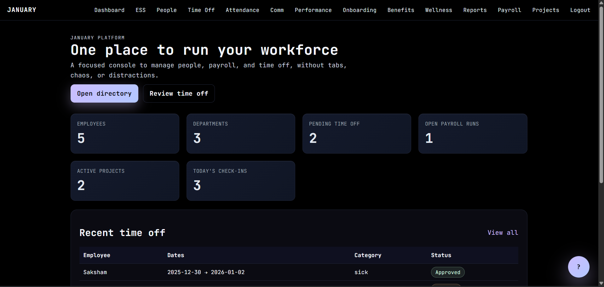

# January Portal (Flask + SQLite)

Modern HR console with employee self-service, communications, attendance, payroll, projects, performance, onboarding, benefits, wellness/recognition, analytics, and a Gemini-powered chat.



## Features
- Dashboard with people, payroll, projects, attendance stats, and recent time off.
- ESS portal with directory, announcements, onboarding tasks, and recognitions.
- Communications (announcements + channel messages).
- Time & Attendance tracking (check-in/out, statuses, hours).
- Payroll runs, projects and assignments, time off workflow.
- Performance reviews, onboarding tasks, benefit enrollments.
- Wellness/recognition feed.
- Reporting & analytics page plus `/system/health` JSON.
- Floating Gemini chat (set `GEMINI_API_KEY`).

## Prerequisites
- Python 3.10+ (Windows, macOS, or Linux)
- pip

## Setup (any computer)
1) Clone and enter the repo
   ```bash
   git clone <your-fork-or-repo-url> goon
   cd goon
   ```
2) Create and activate a virtualenv
   - Windows (PowerShell):
     ```pwsh
     python -m venv .venv
     .\.venv\Scripts\Activate.ps1
     ```
   - macOS/Linux:
     ```bash
     python -m venv .venv
     source .venv/bin/activate
     ```
3) Install dependencies
   ```bash
   pip install -r requirements.txt
   ```
4) Configure environment
   - Copy `.env` (already present) and set values:
     - `GEMINI_API_KEY` = your Gemini key
     - `SECRET_KEY` = a strong random string
     - `SQLALCHEMY_DATABASE_URI` (defaults to `sqlite:///hr.db`)
5) Initialize and seed the database
   ```bash
   flask --app app init-db
   flask --app app seed
   ```
6) Run the app
   ```bash
   flask --app app --debug run
   ```
7) Sign in
   - Open http://127.0.0.1:5000
   - Credentials: `admin@local` / `admin123`

## Usage highlights
- Attendance: log check-in/out, filter by date.
- Communications: post announcements and channel messages.
- Performance: create reviews with rating/status.
- Onboarding: add tasks, inline status updates.
- Benefits: enroll employees with provider, coverage, status, dates.
- Wellness: send kudos/badges with notes.
- Reports: view key metrics; health JSON at `/system/health`.
- Chat: click the floating ? button; uses `GEMINI_API_KEY`.

## Resetting data
- Delete `hr.db` in the project root, then rerun `flask --app app init-db` and `flask --app app seed`.

## Notes
- Keep secrets in `.env`; avoid committing real keys.
- For production, move to a real database and add a WSGI server (gunicorn/uwsgi) plus HTTPS and stronger auth/RBAC.
